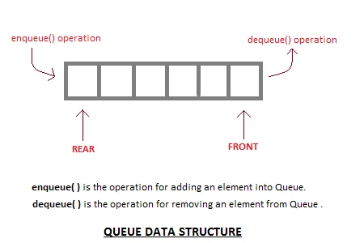
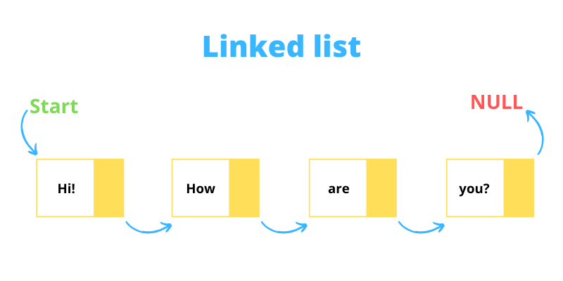

<h1 align = "Center" >Linear Data Structures🏗️🏦</h1>

# Stack-📚📚

### The data structure follows the rule of LIFO (Last In-First Out) where the data last added element is removed first. Push operation is used for adding an element of data on a stack and the pop operation is used for deleting the data from the stack.

###### Ref - <a href = "https://www.geeksforgeeks.org/stack-data-structure/">Geeksforgeeks</a> <a href = "https://pepoding.com">Pepcoding</a>

# Queue 🧑🏻‍🤝‍🧑🏻🧑🏻‍🤝‍🧑🏼👯

### Queue is also an abstract data type or a linear data structure, just like stack data structure, in which the first element is inserted from one end called the REAR(also called tail), and the removal of existing element takes place from the other end called as FRONT(also called head).

# Linked List 📃🔐🔑

### A linked list is a sequence of data structures, which are connected together via links.Linked List is a sequence of links which contains items. Each link contains a connection to another link. Linked list is the second most-used data structure after array. Following are the important terms to understand the concept of Linked List

<h1 align = "center">Made with 💗 </h1>