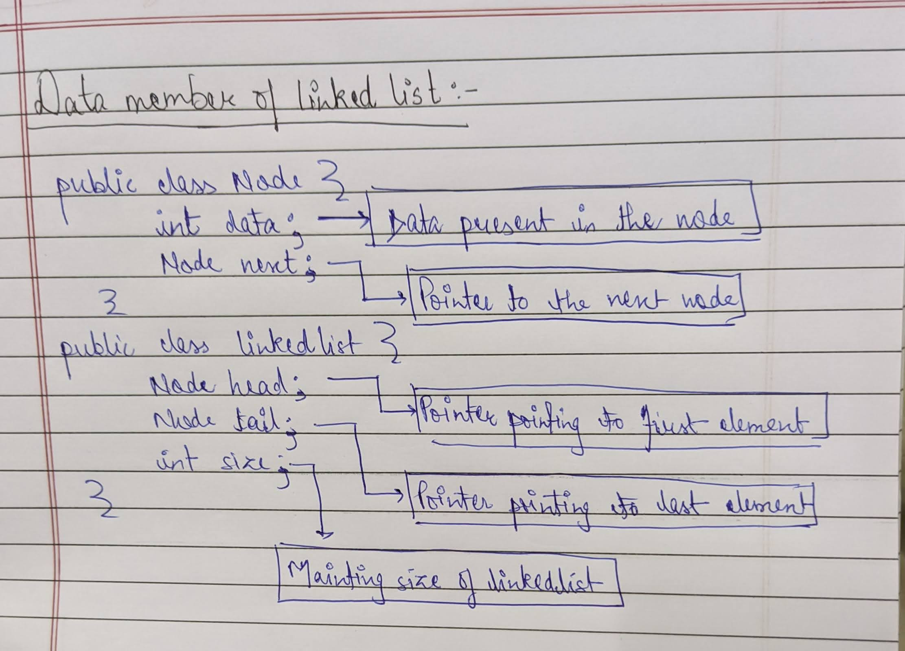

 > # Basic of LinkedList
 We will make two class One for Node and another for linked list.Node class will help us to make new elements.And Linked class will help us to maintain the description about linkedlist(Head node,tail node,size of linkedlist).

> # Basic Questions 👨‍🏫🏫
* AddAt -- Code to insert element at the given index. 
* AddFirst -- Code to insert element at the O(Zeroth index) of list. 
* AddLast -- Code to insert element at the last of list 
* Display -- Code to display all the elements of list. 
* GetValue -- Code to get the values present at the given index. 
* RemoveFirstElement -- Code to remove element present at the zeroth index. 
* RemoveLast -- Code to remove element present at the last. 
* ReverseAListUsingDataiterator - Code to reverse list using loop. 
* ReverseAListUsingPointeriterator - Code to reverse list using double pointers 
* RemoveAt - Code to remove a element from particular index.
> # Problems
* Linkedlist to stack adapter -- Code to behave list as a "Stack".
* Linkedlist to queue adapter -- Code to behave list as a "Queue".
* Kth element from end -- Code to get kth element from end (without using iteration directly or using size property) 
* Middle of list -- Code to get middle element without using iteration directly or using size property. 

